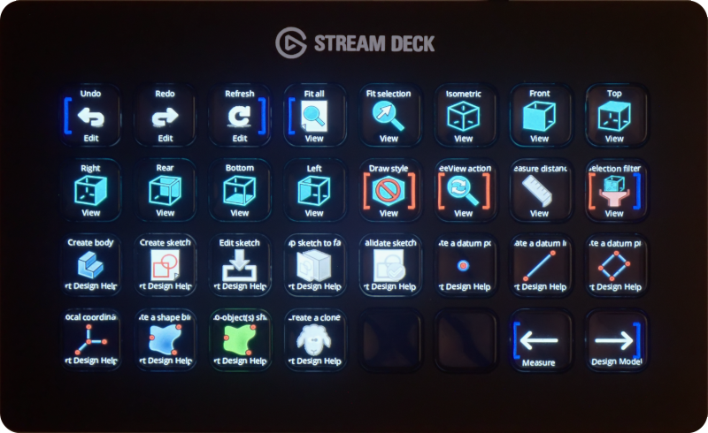
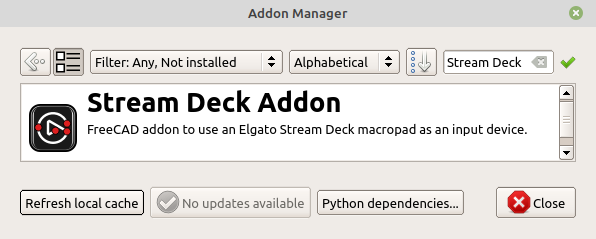
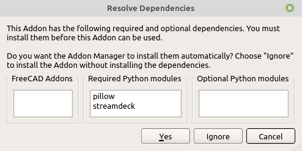

# FreeCAD2026 Stream Deck Addon
### Version 0.3.0
This is a fork of the FreeCAD Stream Deck Addon, modified to work with FreeCAD 1.1.3 +
The original appears to have been abandoned since no updates in 2 years and multiple pull requests have gone unanswered.  If I'm mistaken and you are the original author, please contact me and I'll be happy to help merge the changes into your branch.
I fully admit, that Claude Code did 99% of the work to make these changes, but I verified proper operation after each step. Unit tests have been added to some portions to help maintain stability as FreeCAD continues to grow and improve.

* [Usage](#Usage)
* [Installation](#Installation)
* [Settings](#Settings)
* [Notes](#Notes)
* [Changes in v0.3.0](#Changes-in-v030)
* [Discussion](#Discussion)
* [License](#License)

FreeCAD addon to use an [Elgato](https://www.elgato.com) [Stream Deck](https://www.elgato.com/us/en/s/welcome-to-stream-deck) macropad as an input device.

## Usage

The toolbar tools displayed in the FreeCAD window are mirrored in real-time on the Stream Deck keys. When a key is pressed, the corresponding tool is applied as if selected in the main window.

When a Stream Deck key representing a tool with a sub-menu is long-pressed, the tool is expanded to show the additional tools in the sub-menu. When any of the expanded sub-menu tools is long-pressed again, the sub-menu is collapsed back to a single tool. The tools with sub-menus are shown between red brackets.

The toolbar tools are organized in pages of keys. A toolbar occupies its own set of pages.

Certain toolbars may be displayed on all the pages. Those tools are shown between blue brackets. Other toolbars can be excluded from the Stream Deck and never shown.

Two keys at the bottom right of the Stream Deck are used to change pages. If the Stream Deck has dials, the dials are used to change pages instead.

## Installation

### Addon manager
If you are reading on GitHub, then in FreeCAD, go to **Edit ▶ Preferences** and select **Addon Manager**. Under **Custom Repositories**, click **+** to add a new repository source. Then for the URL put "https://github.com/Tamagotono/freecad2026_streamdeck_addon.git" and for the branch put "master". Now you are ready to move on to the next step.

In the FreeCAD menu, go to **Tools ▶ Addon manager** and select **FreeCAD2026 Stream Deck Addon**:

Select **Install**, then install the required Python modules:

### Manual installation

Copy or clone this git repo directory in your FreeCAD addon directory. Typically:

User:
  - Linux:   `~/.local/share/FreeCAD/Mod/`
  - Windows: `%APPDATA%\FreeCAD\Mod\`

System-wide:
  - Linux:   `/usr/share/freecad/Mod/`
  - Windows: `C:\Program Files\FreeCAD\Mod\`

You also need to install the following Python modules (e.g. with `python -m pip install`):

- pillow
- streamdeck

*Note: If you use a FreeCAD AppImage in Linux, the addon may not find the streamdeck or pillow package on your system. You can solve the problem by installing it directly into the directory the addon was installed in with `python -m pip install --target=<directory>`.*

### Windows-specific

The HIDAPI library must be installed for the streamdeck Python module to work correctly. To install it:

  - Download the latest `hidapi-win.zip` file from https://github.com/libusb/hidapi/releases
  - Copy the `hidapi.dll` file inside the ZIP file into `C:\Windows\System32` as administrator

## Settings

Settings can be configured in two ways:

- **Edit ▶ Preferences ▶ Stream Deck** — the recommended way. Changes take effect when you click OK or Apply.
- **Tools ▶ Edit Parameters ▶ BaseApp ▶ StreamDeckAddon** — the advanced parameter editor. Changes take effect immediately.

The settings are:

- **Enabled**

  Enable or disable the addon. When it is disabled, the Stream Deck device is fully released and usable by other applications while FreeCAD is running.

- **Device ▶ Filter ▶ UseDeviceType**

  The type of the Stream Deck device you want to use if more than one device is connected. E.g. `Stream Deck XL`. Leave blank to use a device of any type.

- **Device ▶ Filter ▶ UseDeviceSerial**

  The serial number of the Stream Deck device you want to use if more than one device is connected. E.g. `A00NA325307HF5`. Leave blank to use a device with any serial number.

- **StartStopCommands ▶ ExecuteShellCommandWhenStarting**

  Shell script to run when starting. Useful to kill another Stream Deck application such as streamdeck-ui and release the Stream Deck device for use by this addon. E.g. `killall streamdeck`. Leave blank to disable.

- **StartStopCommands ▶ ExecuteShellCommandWhenStopping**

  Shell script to run when stopping. Useful to restart another Stream Deck application such as streamdeck-ui after the Stream Deck device has been released by this addon. E.g. `streamdeck --no-ui &`. Leave blank to disable.

- **ToolbarLists ▶ ToolbarsExcluded_CommaSeparated**

  Comma-separated list of names of toolbars you never want displayed on the Stream Deck regardless of whether they're enabled in the main window, to reduce clutter. E.g. `Workbench, Edit Mode`. Leave blank to display all the toolbars on the Stream Deck.

- **ToolbarLists ▶ ToolbarsOnEveryPage_CommaSeparated**

  Comma-separated list of names of toolbars you want repeated on all the Stream Deck pages, so they're always available regardless of the particular toolbar page you're in. E.g. `Constraints, Geometries`. Note that those permanently-displayed toolbars are laid out on the Stream Deck in the order they're listed.

  If your Stream Deck has enough keys - Stream Deck XL for example - you can have more permanently-displayed toolbar tools without multiplying the number of pages.

  If your Stream Deck has fewer keys, you may want to have fewer permanently-displayed toolbar tools to free up more keys per page.

  Leave blank if you don't want any toolbars repeated on all the pages.

  > **Finding toolbar names:** Toolbar names must match FreeCAD's internal Qt object names, which may differ from the labels shown in the FreeCAD UI and are case-sensitive. Names may contain spaces — separate multiple entries with commas or semicolons. The addon prints detected toolbar names to the FreeCAD Report View whenever the toolbar list changes, which is the easiest way to find the correct names.
  >
  > Known names for common workbenches:
  >
  > | Workbench | Toolbar names |
  > |---|---|
  > | All | `Workbench`, `Edit Mode` |
  > | Sketcher | `Geometries`, `Constraints`, `Sketcher Tools`, `B-Spline Tools`, `Visual Helpers` |

- **Display ▶ Brightness ▶ BrightnessPercent**

  How bright the Stream Deck's display should be. Percentage from 0% to 100%.

- **Display ▶ ScreenSaver ▶ Enabled**  
  **Display ▶ ScreenSaver ▶ FadeWhenUserInactiveForSeconds**  
  **Display ▶ ScreenSaver ▶ FadeToBrightness**  
  **Display ▶ ScreenSaver ▶ FadeTimeSeconds**  

  Stream Deck screen saver settings.

All setting changes take effect immediately. You don't need to restart FreeCAD.

## Notes

- The addon needs exclusive access to the Stream Deck device. It cannot coexist
  with Elgato's Stream Deck software on Windows or with streamdeck-ui on Linux.
  Either the addon has control of the Stream Deck device or the other
  application does, but not both at the same time.

- Tested with FreeCAD 1.1.3 and FreeCAD Weekly Build 2026.08.05 (26.3) on Linux, with a Stream Deck Mk2, Stream Deck XL and Stream Deck +. It may or may not work with other FreeCAD versions or Stream Deck models.

- This software is still under development. Please bear with me as I make it nicer 🙂

## Changes in v0.3.0

Changes from the original addon by Giraut:

- **FreeCAD 1.1.x compatibility** — ported to Python 3.11 and PySide6. Also tested with FreeCAD Weekly Build 2026.08.05 (26.3)
- **Preferences panel** — settings are now accessible under **Edit ▶ Preferences ▶ Stream Deck** in addition to the Parameter Editor
- **Bundled font** — OpenSans-Regular.ttf is included to support macOS and any platform where the expected system font is unavailable
- Minor bug fixes

## Discussion

Feel free to give feedback, suggestions or discuss issues in the [official FreeCAD forum thread](https://forum.freecad.org/viewtopic.php?t=85871).

## License

GPL-3.0
